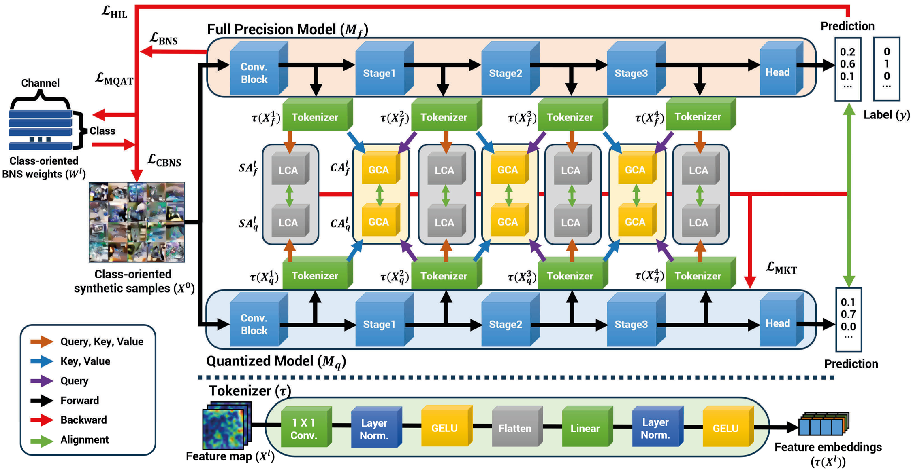

# MKT

## Overview
Data-free quantization (DFQ) generates an n-bit quantized (Q) model without original data used for training a full-precision (FP) model. In general, DFQ first produces optimized noise or synthetic samples and then aligns intermediate or final outputs between FP and Q models. Nevertheless, incomplete knowledge transfer for layer- and class-oriented knowledge of the FP model still hinders learning the Q model. To handle these, we align the mutual knowledge between both models. For the mutual knowledge transfer between layers, we present local and global correlation-based alignment (LCA/GCA) between intermediate layers of FP and Q models. These LCA and GCA are achieved by tokenizing a feature map per layer separately and learning mutual local/global correlation within/between layers. Then, we minimize the discrepancy of mutual correlation between FP and Q models. In addition, we presume that batch normalization statistics (BNS) per layer are mutually correlated with classes on a specific domain. We leverage this mutual dependency for noise optimization by adding the learnable embeddings of classes and channels per layer. We then combine the embedding into the common BNS alignment for generating class-oriented noises. To demonstrate the effects of our methods, we present many ablation studies and comparison with other state-of-the-art data-free quantization methods on CIFAR-10/100 and ImageNet. We achieve 57.24% top-1 accuracy on CIFAR-100 and show better scores on other datasets.





## Update

* **2024.08.18**: Update the sample weight files, data loader, and inference codes.
* **2024.08.14**: This repo is created.
* We will open our training code soon.

## Weight File Download

|                Models              |            Google Drive             |       Top-1 Accuracy             |         Description            |
|:----------------------------:|:-----------------------------------:|:-----------------------------------:|:----------------------------------:|    
|      CIFAR-100 (3w3a)     |               [ link](https://drive.google.com/file/d/1mPmOceG88IfCydzNWCtH4fvGCwksL4Ll/view?usp=sharing)          |  57.24%     |  |          
|      ImageNet (3w3a)     |               [ link](https://drive.google.com/file/d/1EC8T6q-31mT3O2wzcNViIAt9zqcJOAil/view?usp=sharing)          |   50.79%    |  |    

## Prerequisites
* Python = 3.10.13
* CUDA = 12.2
* PyTorch = 2.1.2

## Installation

 1. Clone the repo.
 ```
git clone https://github.com/MKT-Author/MKT
 ```


## Running the inference

1. Download the weight file which we provide.

2. Set the weight file in ckpt directory.

3. Set the dataset path where to download in the config file.

* If you already have imagenet dataset, Create a symbolic link with the following command in our MKT path:
```
ln -s <your imagenet path> ./data/imagenet
```

4. Please run the following commands in our MKT path to run the inference.

```
python main.py --conf_path=<your config> --ckpt=<your ckpt>
```


## License

This project is licensed under CC BY-NC 4.0 license. Redistribution and use of the code for non-commercial purposes should follow this license. 
